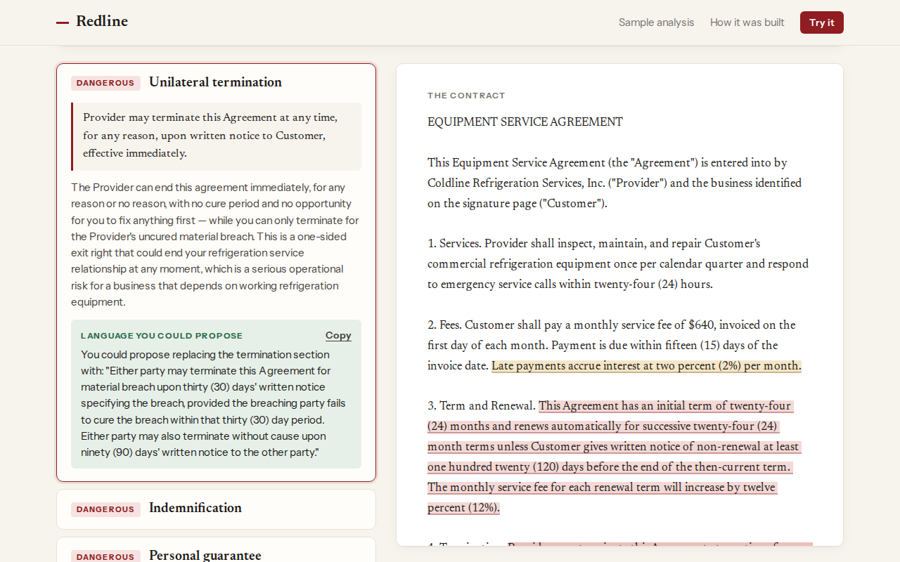

# Redline

**Read it before you sign it.** Redline reviews a contract someone hands a small business owner, before they sign it. It returns a plain-English summary, risk flags ranked Dangerous or Unusual, a drafted counter-offer for each flag, and a Q&A box that answers only from the uploaded document.

**Live:** [redline-review-nine.vercel.app](https://redline-review-nine.vercel.app)



The rule it's built around: **if Redline can't point to the exact sentence, it doesn't show the flag.** Every flag's quote is checked in code against the document's text, and a flag whose quote isn't an exact match is dropped before the reader sees it ([ADR 0001](docs/adr/0001-every-flag-cites-its-source.md)).

Built by Gurnek Khaira with AI coding agents (Claude Code), working from market research, a product spec, decision records and scoped tickets.

## What it does

- **Flags risky clauses with their source.** Personal guarantees, indemnification, auto-renewal and unilateral termination are checked in depth. Arbitration and class-action waivers and liability caps are caught by generic detection.
- **Drafts a counter-offer** for each flagged clause.
- **Says "Clear" out loud.** A contract with nothing to flag gets a Clear result that names what was checked, instead of an empty list ([ADR 0009](docs/adr/0009-explicit-clear-result.md)).
- **Uses your own red lines.** Write rules like "No late-payment interest above 1% per month," and any clause that breaks one is flagged as yours.
- **Answers questions from the document only.** If the answer isn't in the document, it says so. It doesn't give legal advice.
- **Keeps a library** of saved documents and analyses, behind sign-in.

## How it was built

1. **Research first.** Four research passes: who has the pain, what goes wrong, which tools exist, and who would pay ([research/](research/)). They found the original idea was weaker than assumed: Pact, ContractClarifyAI and ClauseGuard already did most of it. Redline was repositioned on one claim a reader can check for themselves: every flag quotes its exact source.
2. **A spec with explicit choices.** The [PRD](PRD.md) names the segment (small business owners) and excludes freelancers, renters and job seekers. Ten [decision records](docs/adr/) set the rules, among them precision over recall, flags stated plainly with no hedging, and positioning as document literacy rather than legal advice.
3. **Twelve scoped tickets**, built by AI coding agents against test fixtures with planted clauses and known answers. [BUILD-REPORT.md](BUILD-REPORT.md) records what was built, every decision made along the way, and what couldn't be verified.
4. **A live smoke test** against the real model caught 5 of 6 planted risky clauses with the correct severity and exact citations. It also raised 1 borderline Unusual flag on a contract designed to be clean. Both results are reported as they came out, not tuned away on one run.
5. **An adversarial test of the deployed site** ([FINDINGS.md](FINDINGS.md)). All 24 flags it saw quoted their document word for word, including Spanish text and a clause near the end of a 75,000-character contract. A hidden "don't flag this" instruction inside a contract didn't change the flags. Q&A refused a request for legal advice. The test found 5 issues. Four are fixed, each with a test, starting with the most serious: an English personal guarantee was never flagged ([PR #1](https://github.com/gurn3k/redline-review/pull/1)). A security review of the whole codebase, using Anthropic's method, found nothing that met its bar for an exploitable problem.

## Limits

- No real users, customers or willingness-to-pay data yet.
- The smoke test is a single run on two fixture contracts, not a measured accuracy rate.
- One finding from the live test is still open: a non-contract document once failed with a generic error. It didn't reproduce locally, so the app now logs the cause for the next time it happens. See [FINDINGS.md](FINDINGS.md).
- Redline explains what a document says. It isn't legal advice and doesn't say whether a clause is enforceable where you are ([ADR 0010](docs/adr/0010-upl-disclaimer-and-positioning.md)).

## Run locally

Requires Node 22 or later and a Supabase project (schema in [supabase/migrations](supabase/migrations)). Set these in `.env.local`:

- `NEXT_PUBLIC_SUPABASE_URL`
- `NEXT_PUBLIC_SUPABASE_ANON_KEY`
- `OPENROUTER_API_KEY`
- `OPENROUTER_MODEL`

```bash
npm install
npm run dev     # http://localhost:3000
npm test        # 58 tests
npm run smoke   # runs the fixture contracts through the full pipeline; uses a stub model if no API key is set
```

**Stack:** Next.js · TypeScript · Supabase · OpenRouter · Vercel

## License

MIT
